## Project Title : Build NYC Analytics 

## Table of Contents

- [Dataset Description](#dataset-description)
- [Task 0: Setting up your environment](#task-0-setting-up-your-environment)
- [Task 1: Data importing and transformation](#task-1-data-importing-and-transformation)
  - [EDA Visualizations](#eda-visualizations)
    - [Statistics (by Borough) Visualization](#statistics-by-borough-visualization)
    - [Bar Chart, NTA Summary and Top 20 by Filings](#bar-chart-nta-summary-and-top-20-by-filings-20212025)
    - [Histogram - Filings by Year and Half Year](#histogram---filings-by-year-and-half-year)
    - [Choropleth Graph: Filings by NTA](#choropleth-graph-filings-by-nta-2021--2025)

- [Task 2: Data Visualization and Analytics](#task-2--data-visualization-and-analytics)
  - [Q1: Monthly Filing Counts Variation](#q1-how-do-monthly-filing-counts-vary-across-boroughs-and-which-boroughs-show-the-strongest-seasonality)
    - [Line Chart - Monthly Filings by Job Type](#1-visualization--line-chart----monthly-filings-by-job-type-specific-to-boroughs)
    - [Clustered Bar Chart - Monthly Filings](#2-visualization--clustered-bar-chart---monthly-filings-by-job-type)
  - [Q2: Initial Project Costs by Job Type-Grouped Boxplots](#q2-how-do-initial-project-costs-differ-across-job-types-within-each-borough-and-how-heavy-is-the-high-cost-tail)
  - [Q3: Distribution of Approval Time](#q3-what-is-the-distribution-of-approval-time-filing--approval-by-job-type-and-borough-and-which-segments-have-the-longest-delays)
    - [Dumbbell Graph - Approval Time](#1-visualization--dumbbell-graph---typical-vs-near-worst-case--median--p95-approval-time)
    - [Ridgeline Graph - Approval Time](#2-visualization--ridgeline-graph---approval-time-by-borough--top-4-job-types)
  - [Q4: Dwelling Units Added/Removed](#q4-how-many-dwelling-units-are-added-or-removed-net-over-time-by-borough-and-job-type)
    - [Butterfly Chart - Dwelling Units (2024)](#1-visualization--butterfly-chart---dwelling-units-added-vs-removed-by-borough-year-2024)
    - [Bump Chart - Borough Rankings](#2-visualization--bump-chart---borough-rankings-by-net-dwelling-units-over-time)

- [Task 3: Interactive and Extended Vega-Lite Visualizations](#task-3--interactive-and-extended-vega-lite-visualizations)
  - [1) Interactive Clustered Bar Chart](#1-visualization--clustered-bar-chart---monthly-filings-by-job-type)
  - [2) Interactive Ridgeline Graph](#2-visualization--ridgeline-graph---approval-time-by-borough---top-4-job-types)
  - [3) Interactive Butterfly Chart](#3-visualization--butterfly-chart---dwelling-units-added-vs-removed-by-borough-year)
  - [4) Interactive Choropleth with bubbles](#4-visualization--choropleth-with-bubbles-linked-time-series-with-brush)

### Dataset Description

- Shape: 811,493 rows × 85 columns
- Source: DOB NOW: Build – Job Application Filings (NYC Department of Buildings)
- Grain (row-level): One record ≈ one job filing (application)
- Scope: Building/construction permit filings across NYC boroughs, with costs, floor area, work types, parties, status dates, and basic geospatial identifiers.
#### Core fields (high-level)

- Identifiers: Job Filing Number (primary ID)
- Location: Borough, House No, Street Name, Postcode, Latitude, Longitude, Council District, Census Tract, NTA
- Dates (as strings): Filing Date, Current Status Date, First Permit Date, Approved Date, Signoff Date
- Project descriptors: Job Type, Building Type, Review Building Code, Request Legalization, In Compliance with NYCECC, Exempt from NYCECC
- Size & cost: Initial Cost (float), Total Construction Floor Area (float)
- Existing / Proposed attributes: stories, height, and dwelling units (Existing*, Proposed*)
- Work-type flags (mostly ints 0/1): e.g., Sprinkler (Work Type), Plumbing (Work Type), General Construction (Work Type), Structural (Work Type), Sidewalk Shed (Work Type), etc.

#  Task 0: Setting up your environment
- Imported python libraries like Pandas - 2.2.3, GeoPandas - 1.1.1, Altair, Point (shapely.geometry), pathlib and imported the csv file as a dataframe using pandas.
- Imported
 nyc_nta.geojson for the choropleth visualization in the upcoming task.

#  Task 1: Data importing and transformation
## Steps Perfomed:
- Loaded with Pandas; spatial frames created with GeoPandas.
- Datetime parsing: performed with 3 stages -  explicit format "%m/%d/%Y %I:%M:%S %p",  fallback "%m/%d/%Y", general parser (errors='coerce').
- Reduced the timeframe from 2016-2025 to 2021-2025 to keep the dataset relevant and manageable.
- Column level cleaning: Performed a missingness audit and dropped 8 columns with ≥ 90% missing after profiling, leading to the shape - 811,493 × 77
- Row level cleaning: Removed rows with missing 'Filling Date'. Checked for duplicate filings and created a tie-break with status priority 'Current Status Date'
- Removed data points that do not fall under NYC bounds (lat/long).    
- Outlier Detection and Winsorization: To avoid extreme tails dominating aggregates, we computed p99.9 per column on the cleaned data. And winsorized fields - 'Initial Cost','Total Construction Floor Area'; Structural fields: Existing/Proposed Height, Existing/Proposed No of Stories, Existing/Proposed Dwelling Units
- Converted common 0/1 work-type indicators to nullable Boolean. Performed median imputation on Total Construction Floor Area -> Floor_Area
- Built a GeoDataFrame (gdf_ready) from Longitude/Latitude in WGS84 (EPSG:4326), verified NYC bounds, and kept it as the spatial version of the cleaned table for all mapping and spatial joins.

## EDA Visualizations:

## Statistics (by Borough) Visualization.
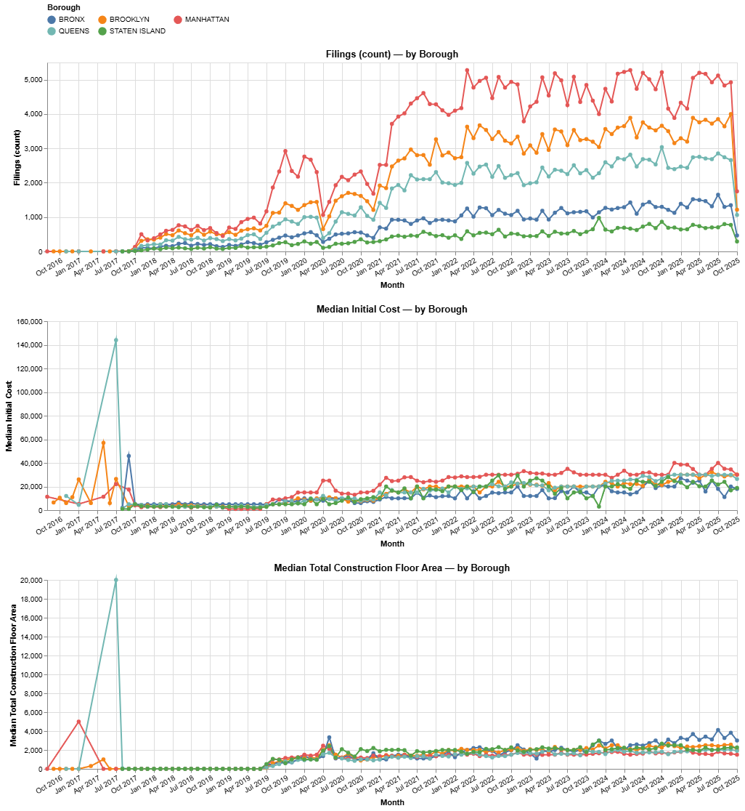  
Question: How do filings, median initial cost, and median total construction floor area evolve by borough over time? Are there shocks or persistent differences across boroughs?
- **Filings by Borough** - Manhattan leads throughout with a strong step-up from 2021; Brooklyn and Queens track lower but similarly. Bronx and Staten Island remain small and more volatile, hinting at episodic project bursts rather than steady pipelines..  *Filings exhibit a citywide trough in Mar-May 2020, with levels recovering through 2021; this timing aligns with COVID-19 restrictions.*  

- **Median Initial Cost by Borough** - Borough medians trend upward since 2021; Manhattan highest, Brooklyn/Queens mid, Bronx/SI lowest - a stable cost hierarchy. *Early isolated spikes are true outliers (pre-cap artifacts); the typical band is ~$20–$40k with gradual creep upward. Filings ≠ cost: months with more filings don’t necessarily show higher median cost-mix effects (job type/size) matter.*

- **Median Total Construction Floor Area** - Medians are remarkably stable with a slow post-2022 increase; Manhattan slightly higher, Bronx/SI lower. *Occasional early spikes (pre-2020) are rare extremes; after capping, typical medians sit in low-thousands sq ft. Cost v/s area isn’t 1:1 across boroughs-suggests price/location premiums and job-type differences (e.g., more interior alterations in Manhattan).*  

## Bar Chart, NTA Summary and Top 20 by Filings (2021–2025)
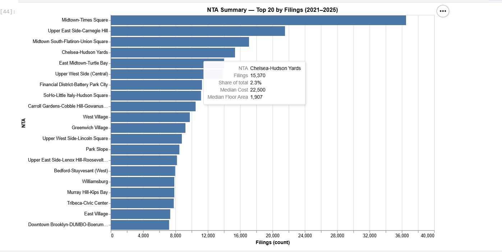  
Which neighborhoods (NTAs) account for the most DOB NOW filings in 2021–2025, and why might those places dominate?
- Manhattan core dominates (Midtown–Times Sq., UES, Flatiron/Union Sq., Chelsea/Hudson Yards, East Midtown, UWS). This is likely because of Building density + commercial intensity: many high-rise offices, hotels, retail-constant interior build-outs, fit-outs, and maintenance.
- Brooklyn shows selective hotspots (Carroll Gdns–Cobble Hill-Gowanus-Red Hook, Park Slope, Williamsburg, Bed-Stuy West) probably due to active residential renovation markets.
- Queens/Bronx NTAs underrepresented in the Top-20. This could be due to more single-/two-family homes → fewer filings per parcel compared with Manhattan’s commercial churn.

## Histogram - Filings by year and half year
 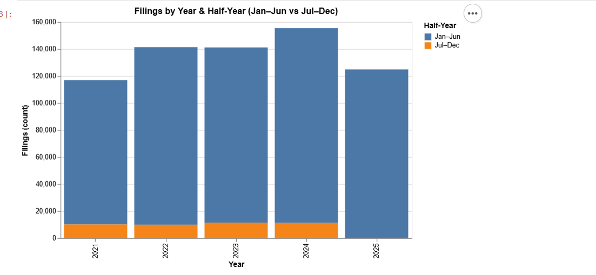 
- From 2021→2024, H2 (Jul–Dec) is consistently a little higher than H1, indicating a second-half bulge in activity.
- 2025 shows only H1 in the data window (we cut off at Oct 13), explaining the apparent drop.
- Interpretation: a seasonal tilt toward late Q3–Q4 filings which is consistent with project budgeting, lease turn-overs after summer, and “get it in before year-end” behavior.

## Choropleth Graph: Filings by NTA (2021- 2025)
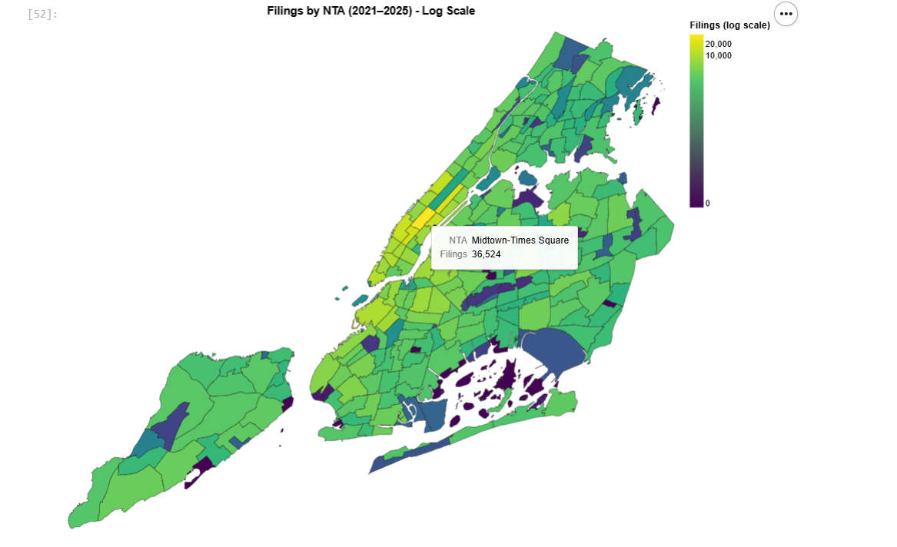 
-Midtown–Times Square and adjacent Manhattan cores glow hottest, which tracks with high commercial density (offices, hotels, retail) that generates constant alteration/tenant-improvement filings.
- Strong Brooklyn pockets (Williamsburg, Park Slope, Carroll Gardens/Gowanus) reflect active multi-family renovation and mixed-use corridors, sustaining many mid-size alteration permits.
- Much of eastern Queens, the Bronx periphery, and Staten Island appear cooler, consistent with lower building density and more 1–2 family homes, which yield fewer filings per tract.
- Using a log color scale reveals that activity is spatially clustered rather than uniform—policy or staffing aimed at filings volume should prioritize the Manhattan core and select Brooklyn NTAs.

## Task 2:  Data visualization and analytics

### **Q1: How do monthly filing counts vary across boroughs, and which boroughs show the strongest seasonality?**   

####  *1) Visualization:- Line Chart -  Monthly Filings by Job Type specific to boroughs* 
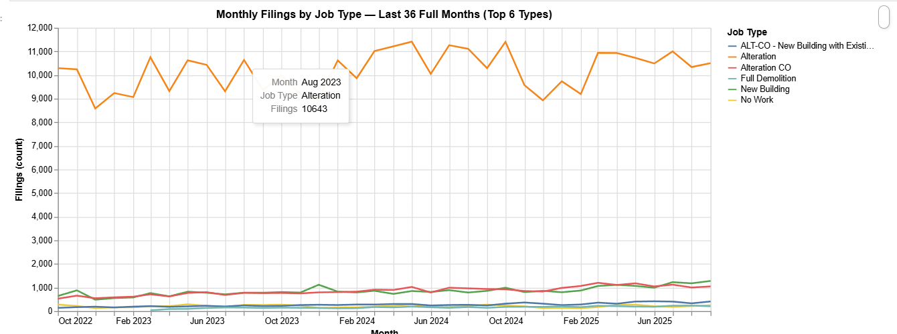  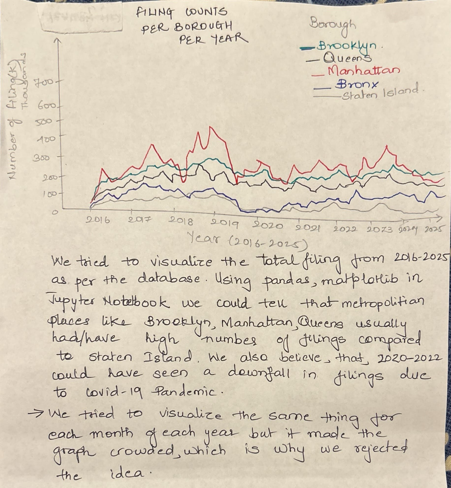 
- We can see peaks in Mar–May and Aug–Oct, troughs in Dec–Jan which is probably due to calendar end effects. 
- New Building and Full Demolition are ~10× smaller, with summer-weighted bumps tied to construction windows and pipelines.
- Commercial tenant churn & office reconfiguration (Manhattan, parts of Brooklyn): renewals and move-ins cluster around spring and post-summer, driving alteration filings in those months.

####  *2) Visualization:- Clustered Bar Chart - Monthly Filings by Job Type* 
 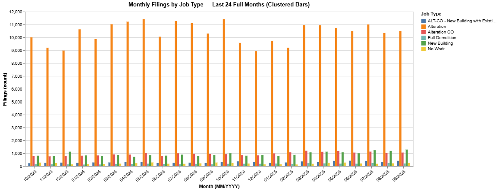  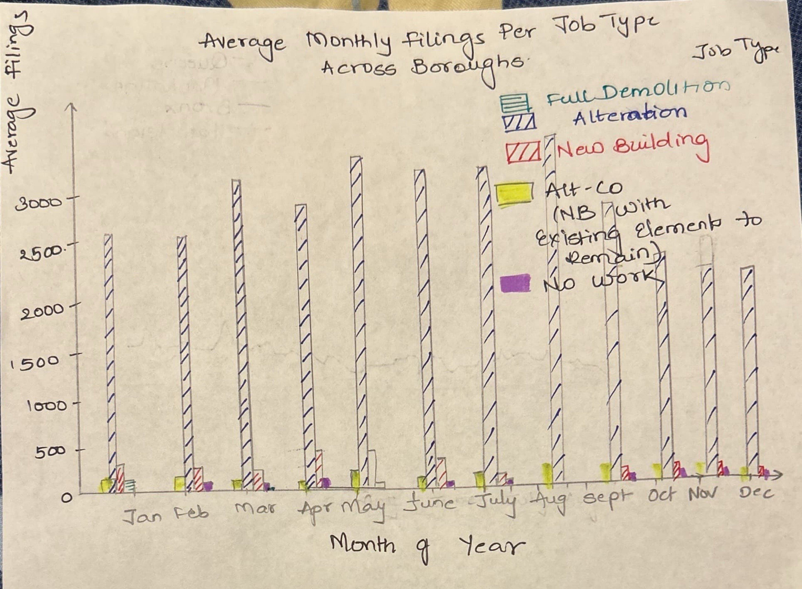 
- Alteration dominates monthly counts and shows the same spring + late-summer pulses seen above.
- New Building and Full Demolition have smaller, sometimes summer-weighted bumps (weather and mobilization constraints).
- Interpretation: seasonality is driven mainly by Alterations (tenant improvements, fit-outs). Boroughs whose mix skews toward alterations exhibit stronger seasonal signals.

### **Q2. How do initial project costs differ across job types within each borough, and how heavy is the high cost tail?**  
 
#### *1) Visualization:- Grouped boxplots:Initial Cost by Job Type × Borough — 2021–2025*
 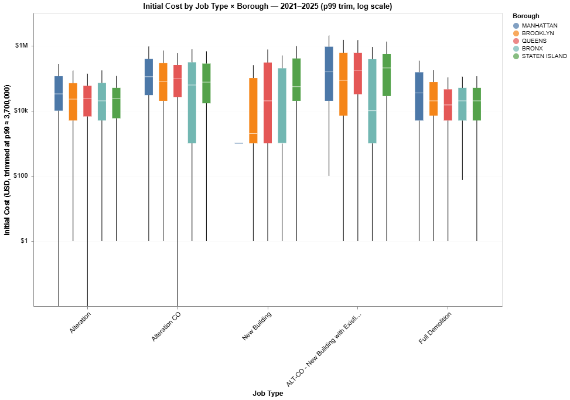  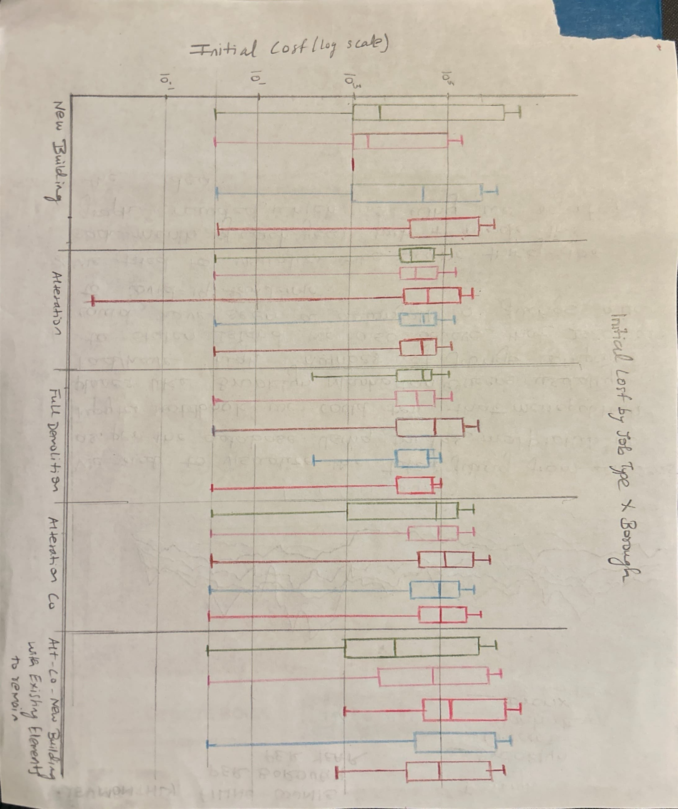
 - Manhattan shows the highest medians/IQRs across job types, consistent with denser sites, premium finishes, and more complex logistics than outer boroughs.
 - Brooklyn/Queens sit mid-tier, reflecting mixed mid-rise/residential stock that is costlier than 1–3 family work but generally simpler than Manhattan.
 - Bronx/Staten Island have the lowest medians and tighter spreads, indicating more uniform, smaller-scope projects.
 - By job type, costs typically rank ALT-CO/New Building > Alteration CO > Alteration ≈ Full Demolition, matching scope intensity (structural/core systems vs. interior changes/deconstruction).
 - Long upper whiskers, especially for Manhattan New Building/ALT-CO—show a small number of very expensive projects; use median/p95 on a log scale rather than means.

 ### **Q3. What is the distribution of approval time (Filing → Approval) by job type and borough, and which segments have the longest delays?**
####  *1) Visualization:- Dumbbell Graph - Typical vs Near Worst-Case — Median → P95 Approval Time* 
 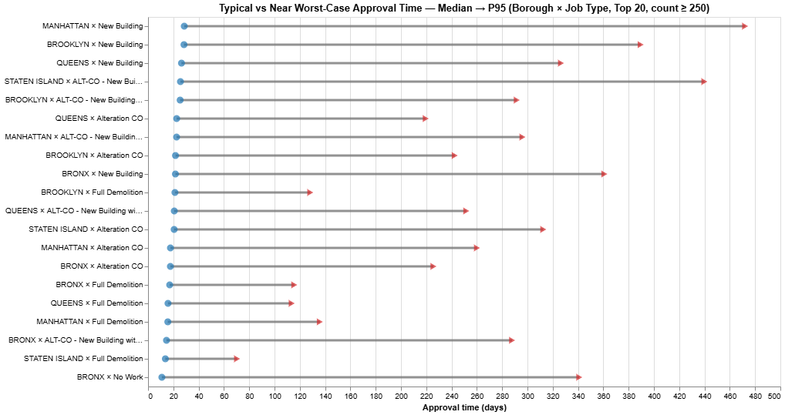  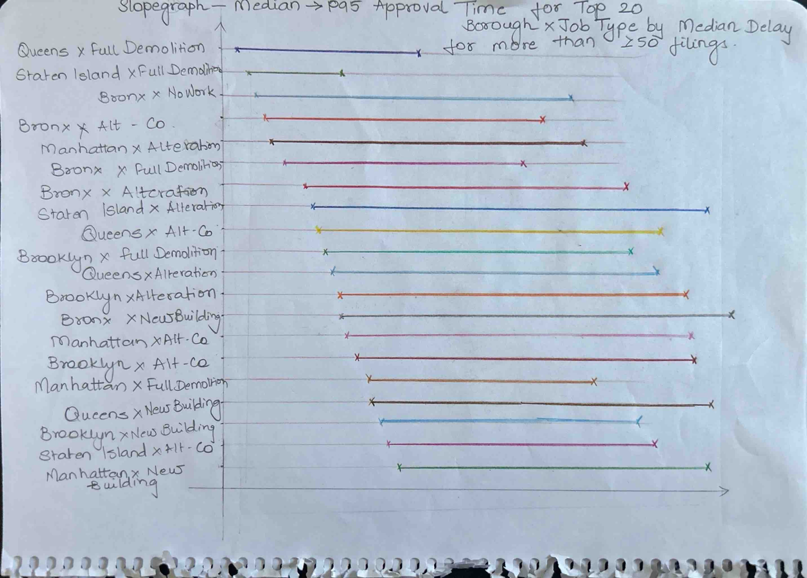 
 - The ladder of delays is consistent: New Building has the largest P95 in every borough (Manhattan highest, then Brooklyn/Queens), followed by ALT-CO; Alteration CO and especially Alteration have shorter medians and markedly smaller tails. 
 - When the gap between the median and P95 is big (as it is for New Building and ALT-CO), it means a small but real share of projects take much longer than usual. So plan extra time: add the biggest schedule buffers for Manhattan New Building/ALT-CO, and the smallest buffers for standard Alterations, especially in Staten Island.

 ####  *2) Visualization:- Ridgeline Graph - Approval Time by Borough — Top 4 Job Types*
 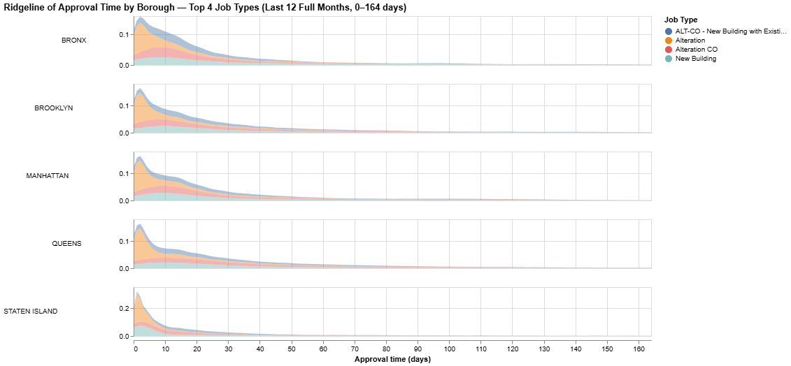  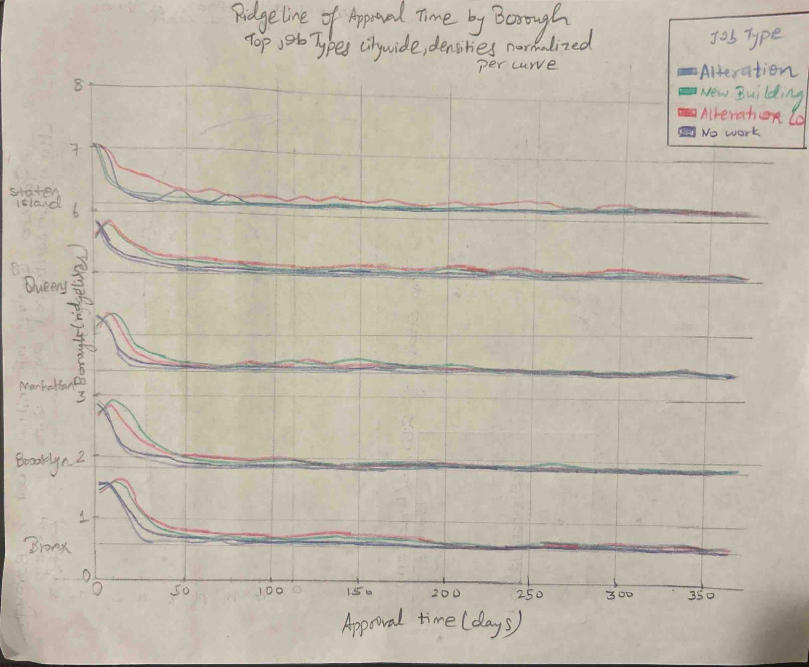
 - All curves are strongly right-skewed: most approvals land in the 0–20 day window; density then decays slowly out to 100–160 days, evidencing long tails.
 - By job type: New Building and ALT-CO (NB with existing elements) have the thickest tails in every borough; Alteration is the narrowest/fastest, Alteration CO sits in between.
 - By borough: Staten Island shows the steepest drop and highest early density (fastest typical approvals); Manhattan and Brooklyn exhibit broader bases and longer tails, indicating more variability and more slow cases; Queens and Bronx are intermediate.

 ### **Q4. How many dwelling units are added or removed (net) over time, by borough and job type?**
 ####  *1) Visualization:- Butterfly Chart - Dwelling Units Added vs Removed by Borough Year 2024* 
  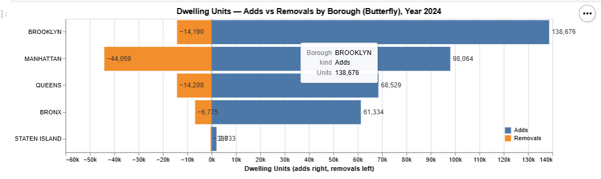  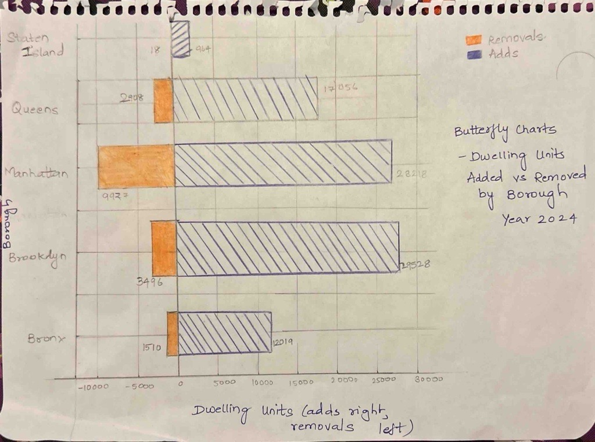
 - Brooklyn drives 2024 net unit growth (~138.7k adds vs ~14.2k removals), implying a pipeline dominated by new multi-family production rather than reconfigs.
 - Manhattan shows the largest removals (~44.1k) against ~98.1k adds, signaling heavier churn from mergers/conversions even as sizable additions proceed.
 - Queens and the Bronx post similar net gains (~+54–55k each) with lower removal intensity, consistent with steady multi-family additions and fewer unit losses.
 - Staten Island is nearly flat (~3.0k adds vs ~2.8k removals), matching its lower-density, 1–2 family profile.
 - Overall, borough differences reflect mix effects: places with more New Building activity (e.g., Brooklyn) yield higher add/remove leverage, while areas with more Alt-CO/merger activity (e.g., Manhattan) show higher offsets (means a larger share of new units is being canceled out by unit losses)

####  *2) Visualization:- Bump Chart - Borough Rankings by net dwelling units over time*
 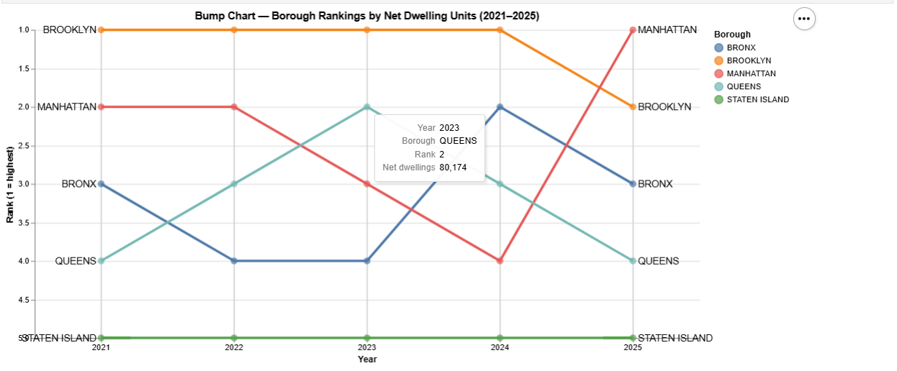  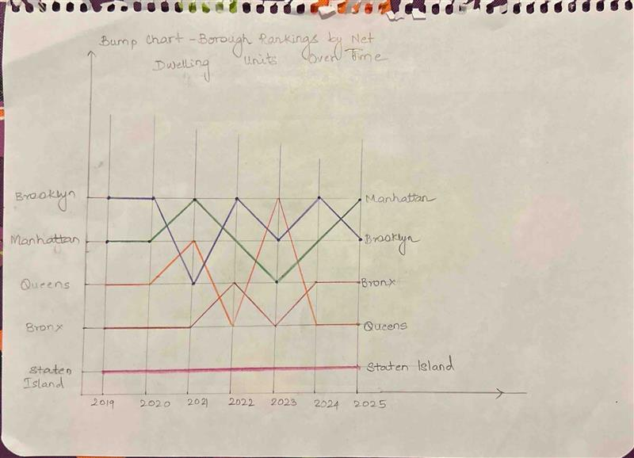
- Brooklyn leads net unit creation from 2021–2024, then slips to #2 in 2025, suggesting its big 2021–2023 pipeline crested while other boroughs’ projects came online.
- Manhattan climbs from #2 → #3 → #4 and then jumps to #1 in 2025, consistent with large projects/COs bunching late and despite - higher offsets from mergers.
- Queens rises to #2 in 2023 but falls thereafter, pointing to a thinner 2024–2025 completion pipeline relative to earlier years Bronx oscillates around the middle ranks, indicating steady but smaller swings in completions.
Staten Island remains last, aligned with its low-density stock; note that 2025 is year-to-date, so rank changes partly reflect timing of when completions hit the ledger.

#  Task 3:  Interactive and Extended Vega-Lite Visualizations
 
####  1) *Visualization:- Clustered Bar Chart - Monthly Filings by Job Type*
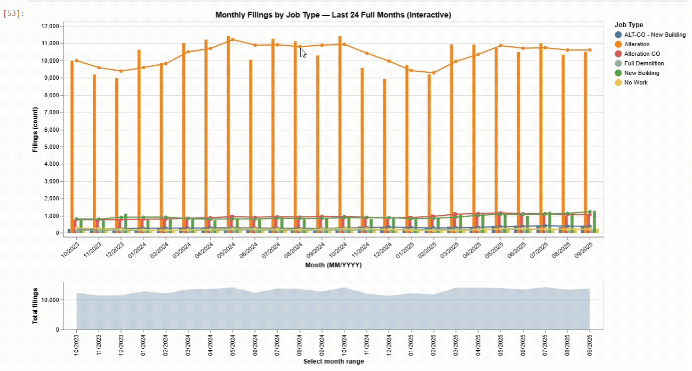
- User can click Legend to Highlight Job Types, Brush over the Overview Chart to select timeline. The legend uses toggle="true", meaning multiple job types can be highlighted simultaneously — supports flexible comparative exploration.
- Hover over bars or points to see exact filing counts or 3-month averages in tooltips, along with the month and job type.
- Pan and Zoom Vertically: Scroll or drag inside the main chart to rescale or move along the y-axis (bind_y=True) — useful when one job type dominates counts.

####  2) *Visualization:- Ridgeline Graph - Approval Time by Borough - Top 4 Job Types*
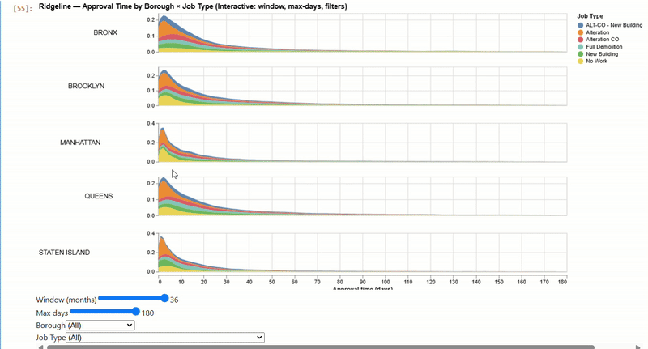
- Added custom tooltip list for hover interaction that shows Borough, Job Type, approval days, and density values — dynamic interactivity enhancement using Vega-Lite’s built-in tooltip encoding.
- facet(row="Borough") arranges one ridge per borough, preserving borough-wise comparison. Custom order + horizontal labels make it readable.
- resolve_scale(y="independent") allows each borough’s density to scale separately, avoiding flattening of smaller distributions.
- mark_area() Creates smooth filled ridgelines with semi-transparent fill (fillOpacity=0.45) and subtle stroke (strokeOpacity=0.9) for layered clarity.

####  3) *Visualization:- Butterfly Chart - Dwelling Units Added vs Removed by Borough Year*
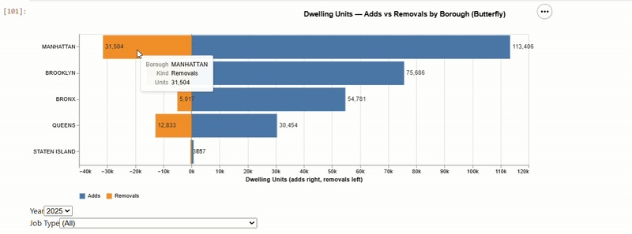
- The previous graph showed analytics only for year 2024. In this graph you can select the year from drop-down.
- User can also select the job-type from the dropdown and analyse which type- contributed to how much of the dwelling units.
- This graph Splits delta_units into positive (adds) and negative (removals). Custom Zero Axis (mark_rule) adds a vertical rule at x=0 to clearly divide additions vs removals.
- Interactive tool tip to get exact values when hovered over the graph.
 
####  4) *Visualization:- Choropleth Map with Bubbles, Linked Time Series with Brush*
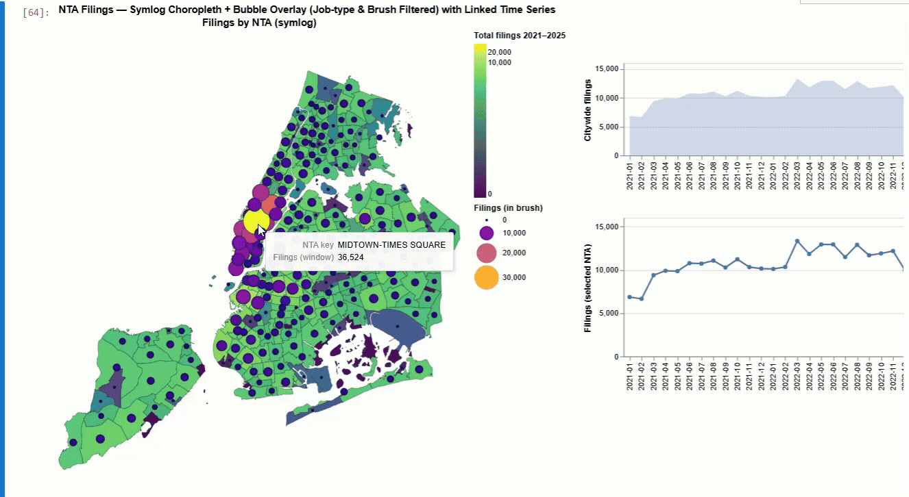
- User can Select Job Type via Dropdown, click any neighborhood (NTA) on the map it highlights, and the linked time series (bottom right) shows that area’s filing trend over time. Click again to clear.
- Hover over polygons or bubbles to see tooltips with neighborhood name and exact filing counts (total or brushed window). Hover over time series to see month-by-month filings.
- Brush Over Time Axis to define a custom time window, this dynamically controls bubble sizes on the map (aggregating filings only within that range).
- Multi-parameter Exploration
All three dimensions (space, time, job type) are explorable together, you can e.g. brush 2023, select “Alteration,” and click on Manhattan to isolate just those filings.

 ## Note:
- To reproduce the output, you can download the CSV file from the [Google Drive link](https://drive.google.com/drive/folders/1b100B7BQVrSQ0hoWeG5cAw5P9yLGnT58?usp=drive_link) as we were not able to upload the large file here.
- To download the complete ipynb with outputs refer to the same link.
- The dataset is taken from -  [DOB NOW: Build – Job Application Filings](https://data.cityofnewyork.us/Housing-Development/DOB-NOW-Build-Job-Application-Filings/w9ak-ipjd/about_data)  

 
 
