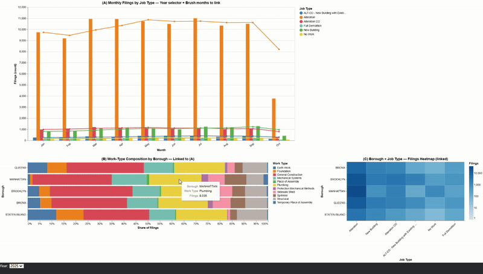
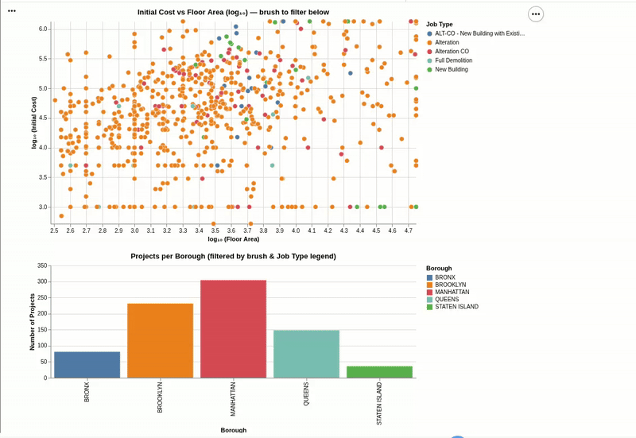
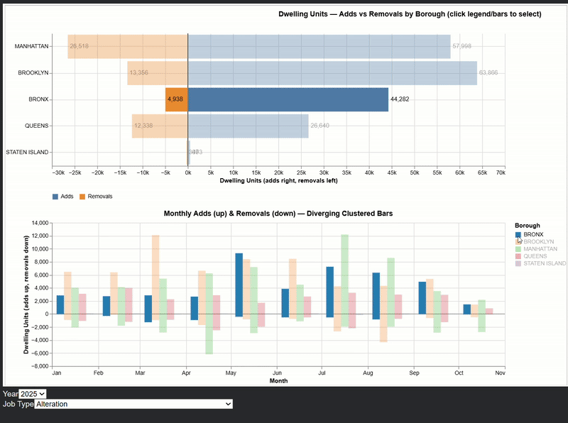
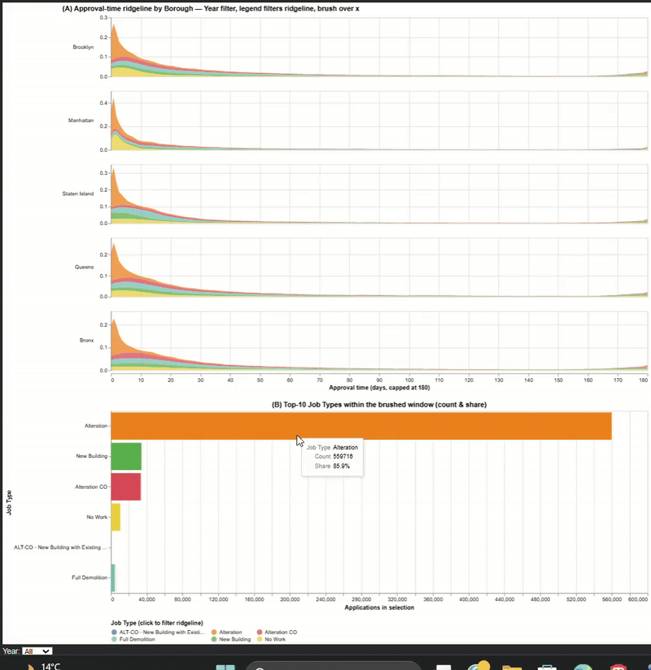
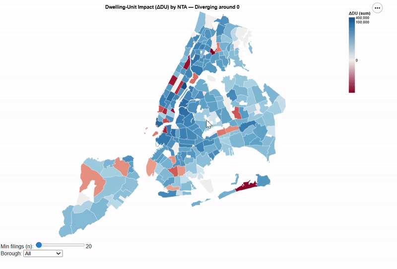
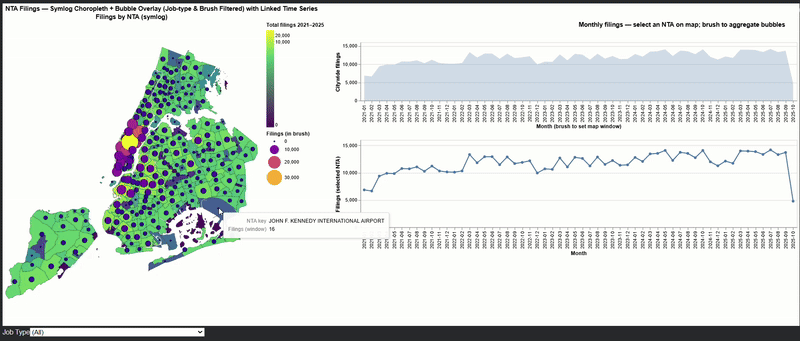
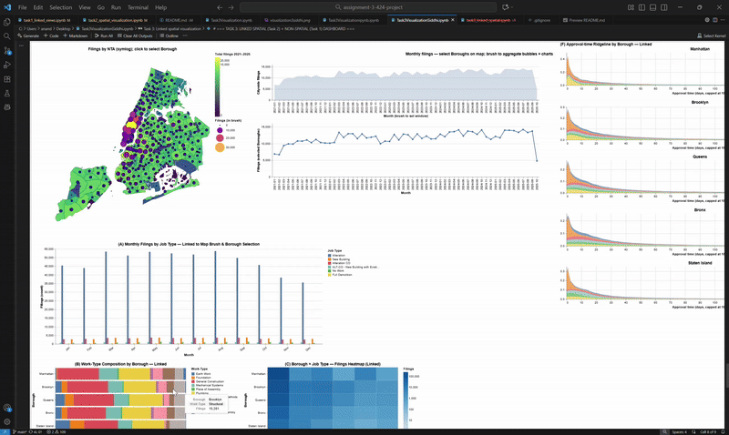

# Table of Contents

  - [Project Title: BuildNYC Analytics](#project-title--buildnyc-analytics)
    
    - [Dataset Description](#dataset-description)
  - [Task 1: Linked view visualizations](#task-1-linked-view-visualizations)
    - [1) Job Type Trends and Work-Type Composition in NYC Filings](#1-job-type-trends-and-work-type-composition-in-nyc-filings)
    - [2) Initial Cost vs Floor Area with Borough Filtering](#2-initial-cost-vs-floor-area-with-borough-filtering)
    - [3) Dwelling Units: Adds vs Removals by Borough and Month](#3-dwelling-units-adds-vs-removals-by-borough-and-month)
    - [4) Approval Time Analysis by Borough and Job Type](#4-approval-time-analysis-by-borough-and-job-type)
  - [Task 2: Spatial Visualizations](#task-2-spatial-visualizations)
    - [1) Dwelling-Unit Impact by NTA (Diverging Choropleth)](#1-dwelling-unit-impact-by-nta-diverging-choropleth)
    - [2) NTA Choropleth + Bubbles + Linked Time Series](#2-nta-choropleth--bubbles--linked-time-series)
  - [Task 3 — Linked Spatial + Non-Spatial Dashboard](#task-3--linked-spatial--non-spatial-dashboard)
  - [Task Divison and Iteration](#task-division-and-iteration)
  - [Note](#note)

# ASSIGNMENT 3
 
## Project Title : BuildNYC Analytics
   
 
### Dataset Description
 
- Shape: 811,493 rows × 85 columns
- Source: DOB NOW: Build – Job Application Filings (NYC Department of Buildings)
- Grain (row-level): One record ≈ one job filing (application)
- Scope: Building/construction permit filings across NYC boroughs, with costs, floor area, work types, parties, status dates, and basic geospatial identifiers.
 
#  Task 1: Linked view visualizations

###  1) **Job Type Trends and Work-Type Composition in NYC Filings**

- **Key attributes extracted:**
    - **Filing Date** → used to extract `year` and `month`
    - **Borough** → categorical grouping for location
    - **Job Type** → classification of filing (e.g., New Building, Alteration)
    - **Work Type Flags** → boolean columns (e.g., Sprinkler, Plumbing, Structural) melted into a single categorical field `WorkType`
- **Motivation and Rationale:** This visualization explores how *construction activity patterns vary across boroughs and job types* in NYC.   
    - It links *monthly job filings* with *work-type composition* and *borough-level intensity*, enabling users to:
    - Identifies which job types dominate filings throughout the year.  
    - Examines the distribution of work types (e.g., plumbing, structural) by borough.  
    - Compares filing density across boroughs for different job types.  
    - By combining three coordinated views, the visualization provides both **temporal** and **categorical** insights into citywide construction trends.
- **Interaction Mechanisms and Methods**
    - **Dropdown Year Selector:** Filters all charts to the selected year.  
    - **Legend Selection:** Toggles job types to focus on selected categories.  
    - **Brush Interaction:** Selecting months in (A) filters both (B) and (C).  
    - **Linked Coordination:** Charts (A), (B), and (C) share interactive parameters for synchronized filtering.  
    - **Methods used:** aggregation, filtering, change mapping, and linked view coordination.
- **Design Decisions:** - Chart (A): Monthly clustered bar + rolling mean line for filing trends by job type.  Chart (B): Stacked normalized bar chart showing share of work types by borough.  Chart (C): Heatmap encoding borough × job type filing intensity.  Brushing is the intuitive mechanism we used to explore temporal subsets without losing context.  
- **Experimentation and Alternatives:** Initially experimented with Separate small multiples for job types — visually cluttered, harder to compare.  Stacked area charts - poor categorical separation.  Unlinked heatmaps - lacked dynamic context across time.  

###  2) **Initial Cost vs Floor Area with Borough Filtering**

- **Key attributes extracted:**
    - **Initial Cost** → represents total estimated construction cost  
    - **Total Construction Floor Area** → total area under development  
    - **Borough** → categorical location grouping  
    - **Job Type** → project classification (e.g., New Building, Alteration)
    - **Derived attributes:** These log-scaled attributes help manage the wide range of cost and area values, revealing patterns that linear scaling would obscure.
        -  `logCost = log₁₀(Initial Cost)`  
        - `logArea = log₁₀(Floor Area)`        
- **Motivation and Rationale:** This visualization explores *how project scale (floor area) relates to project cost* across different construction job types and boroughs.  It enables users to:
    - Detect correlations between **size** and **cost** across NYC construction projects.  
    - Identify which boroughs host more large or expensive projects.  
    - Filter interactively by job type and area range to reveal specific regional patterns.
    - The combination of a scatterplot and histogram provides both **quantitative correlation insight** and **spatial distribution context**. 
- **Interaction Mechanisms and Methods**
    - **Brush Selection:** Draw a rectangular brush over the scatterplot to focus on specific cost–area ranges.  
    - **Legend Selection:** Click on job types in the legend to highlight or filter them dynamically.  
    - **Linked Views:** The bottom histogram updates instantly based on the brushed region and job type selection, reflecting the count of projects per borough.
    - **Methods used:** filtering, brushing, aggregation, and linked-view coordination across scatter and bar charts.
- **Design Decisions:**
    -**Logarithmic Scaling:** Applied to cost and area for balanced visual spread and reduced skew.  
    - **Scatterplot:** Displays cost–area relationships using color-coded job types.  
    - **Histogram:** Summarizes borough-level project distribution for selected ranges.
    - **Opacity Encoding:** Non-selected job types are dimmed rather than hidden to maintain context. 
- **Experimentation and Alternatives:** Initial tests with *linear scaling* and *density plots* were less effective due to extreme variance in cost values.  The log–log scatter better revealed proportional relationships and outliers.  We explored a hexbin chart but discarded it due to loss of categorical distinction.  Final design combines **log scatter (continuous correlation)** with **linked histogram (categorical summary)** to provide interpretable and responsive exploration.
 
###  3) **Dwelling Units: Adds vs Removals by Borough and Month**

- **Key attributes extracted:**
    - **Filing Date** → used to derive `year` and `month`
    - **Borough** → spatial category for grouping
    - **Job Type** → construction classification filter
    - **Existing Dwelling Units**, **Proposed Dwelling Units** → used to compute  
    - `delta_units = Proposed − Existing`  
    - `adds = max(delta_units, 0)`  
    - `removals = -min(delta_units, 0)`
- **Motivation and Rationale:** The visualization explores how *NYC housing stock changes* over time through additions and removals of dwelling units.   It links *aggregate borough-level activity* with *monthly dynamics*, enabling users to identify which boroughs drive the most development and observe seasonal or cyclical construction trends.
- **Interaction Mechanisms and Methods**
    - **Legend Selection:** Click a borough name to highlight and filter both views.  
    - **Bar Selection:** Clicking a bar highlights that borough’s data across both charts.  
    - **Dropdown Filters:** `Year` and `Job Type` allow dynamic filtering.  
    - **Linked Views:** Both charts share a selection (`boroughSel`), enabling synchronized cross-filtering.
- **Methods used:** aggregation, filtering, change mapping, and linked view coordination.
- **Design Decisions:** The *Butterfly Chart* was  Chosen for comparing opposing quantities (adds vs removals) on a shared axis while the *Diverging Clustered Bars* represent positive (adds) and negative (removals) changes over time.*Opacity Encoding* helps to show Selected boroughs at full opacity; others dimmed to 35% for focus.  
- **Experimentation and Alternatives:** We tested grouped and stacked bar charts, but they obscured net change.  The butterfly chart was chosen for better directionality and intuitive comparison.   Diverging bars were refined with monthly aggregation and color consistency for interpretability.  Different interaction types (brush vs legend selection) were tested; legend selection provided a smoother and clearer user experience.  

###  4) **Approval Time Analysis by Borough and Job Type**

- **Key attributes extracted:**
    - **Approval Date**, **Filing Date** → used to compute `approval_days = (Approval Date − Filing Date)`  
    - **Borough** → spatial grouping of projects  
    - **Job Type** → classification of application (e.g., New Building, Alteration)  
    - **Approval Time (capped)** → `approval_days_cap = min(approval_days, 180)` to avoid long-tail distortion  
    - **Year** → extracted for filtering and temporal grouping  
- **Motivation and Rationale:** The goal of this visualization is to analyze **how quickly building permits are approved** across different boroughs and job types.  It helps reveal:
    - Which boroughs show faster or slower approval patterns.  
    - How different job types (e.g., Alteration vs. New Building) vary in approval duration.  
    - How selected time windows correspond to specific project distributions.  
    - By combining **distribution visualization (ridgeline)** and **aggregated counts (bar chart)**, we can explore both the shape and magnitude of approval patterns interactively.
- **Interaction Mechanisms and Methods**
    - **Dropdown Year Filter:** Restricts data to a specific year or shows all filings.  
    - **Legend Selection:** Clicking a job type filters which ridgelines are displayed.  
    - **Brush Interaction:** Dragging over the x-axis (approval-days) filters data in the bottom bar chart.  
    - **Linked Views:** The ridgeline plot (A) and job-type summary chart (B) share parameters for synchronized filtering.
    - **Methods used:** density estimation, filtering, brushing, and linked-view coordination.
- **Design Decisions:** The Ridgeline Chart (Facet by Borough) shows the distribution of approval times per borough.  The bar chart displays the most frequent job types within the brushed approval-time window.  Capped Approval Time prevents long-tail bias from extreme delays
- **Experimentation and Alternatives:** Initial trials with boxplots and violin plots provided limited interactivity and scale clarity.  The **ridgeline plot** was selected for its ability to show multi-borough density comparisons intuitively.  Alternate global y-scaling was tested but replaced by **independent facet scaling** for better visibility of smaller boroughs.  Brushing was added to link density regions with job-type counts, enhancing interpretability and temporal focus.

---

#  Task 2: Spatial Visualizations

### 1) Dwelling-Unit Impact by NTA (Diverging Choropleth)

- An interactive diverging choropleth mapping **net dwelling-unit change (ΔDU)** by NTA, with **borough filtering** and **small-n control**, to highlight neighborhoods experiencing **growth vs contraction** in housing.
- **Key attributes used**
    - **Existing Dwelling Units**, **Proposed Dwelling Units** → `ΔDU = Proposed − Existing`
    - **NTA** → standardized to `NTA_key` for polygon join
    - **Job Filing Number** → counts used to compute `n` (number of filings per NTA)
    - **Borough** → optional dropdown filter
- **Motivation and Rationale:** Show **where housing stock is growing vs shrinking**. Positive ΔDU indicates **adds**; negative ΔDU highlights **removals** or down-sizing.  A diverging map around zero conveys **direction and magnitude** of impact, enabling quick identification of neighborhoods with substantial gains or losses.
 
- **Interaction Mechanisms and Methods**:
    - **Borough dropdown** — filter to a single borough or view all.
    - **Min filings slider (`n`)** — hide NTAs with few filings to reduce noise.
    - **Tooltips** — reveal NTA name, number of filings, and ΔDU statistics.
    -  **Methods used:** computation of ΔDU per filing, **aggregation by NTA** (sum & median), parameter-based filtering, and **diverging symlog** color mapping centered at 0.
- **Design Decisions:**
    - **Diverging palette (`redblue`) + `domainMid=0`** to encode gains vs losses.
    - **Symlog scale** handles heavy positive tails while keeping zero meaningful.
    - **Small-n masking** (slider) avoids unstable colors for sparse NTAs.
    - **Thin white strokes** improve polygon boundary readability.
    - **Mercator projection** and WGS84 geometry for web display.
- **Experimentation and Alternatives:** -
    - Tried **linear diverging**: large positive ΔDU dominated the map; **symlog** improved contrast for moderate changes. Also tried a scatterplot, but with adds and removals its seemed clustered and overplotted

      
### 2) NTA Choropleth + Bubbles + Linked Time Series

- This spatial dashboard links **where** and **when** filings occur using **symlog choropleth + bubble overlay** with **job-type filtering**, **temporal brushing**, and **NTA selection**—meeting the linked-views requirement with coordinated **spatial–temporal exploration** in Vega-Lite.
- **Key attributes used**
    - **Filing Date** → derived `month_start` (month-begin) and `mmYYYY`
    - **Job Type** → dropdown filter for all views
    - **NTA / NTA_name** → standardized to `NTA_key` for joins
    - **Job Filing Number** → unique ID for counting distinct filings
    - **filings_total (2021–2025)** → total filings per NTA for choropleth color
    - **Centroids (lon, lat)** → computed from polygons (projected → WGS84) for bubble placement
- **Motivation and Rationale:** The goal was to reveal **where** filings cluster across NYC and **when** they peak, while allowing focus on **specific job types**.  The map shows **long-term intensity** (choropleth) and **time-filtered activity** (bubbles), linked to citywide and NTA-specific time series for context and drill-down.
- **Interaction Mechanisms and Methods**
    - **Job Type dropdown (`jobSel`)** → filters bubbles and both time series.
    - **Brush on citywide series** → sets the **month window**; bubbles aggregate filings only within the brushed range.
    - **Click an NTA polygon** → selects the NTA; the **NTA line chart** updates to that area.
    - **Linked coordination** across map + both time series via shared selections.
    - **Methods used:** spatial aggregation, temporal aggregation, brushing, point selection, lookup-join (centroids), and multi-view linking.
- **Design Decisions:** 
    - **Symlog choropleth** to handle highly skewed totals while preserving order.
    - **Bubble overlay** sized by brushed-window filings; independent color scales for clarity.
    - **Centroids from projected CRS** (EPSG:2263) to avoid distorted centers; final map in WGS84.
    - **Left–right layout:** map(s) for spatial insight, time series for temporal context and control.
    - **Ordered month labels** ensure consistent brushing and comparison.
    - **Thin polygon strokes** keep boundaries visible without clutter.
- **Experimentation and Alternatives:** - Tried **linear/quantile choropleths** → either washed out low-activity NTAs or saturated high-activity ones; **symlog** gave the best separation. Considered **hexbin density** and **point jitter**; rejected to retain exact NTA boundaries and counts. Tested **single timeline** only; added citywide **area (brush control)** + **NTA line** to separate global vs local trends. Evaluated bubble-only map; final **choropleth + bubbles** communicates baseline vs brushed activity clearly.  

---

# Task 3 — Linked Spatial + Non-Spatial Dashboard

This is a coordinated, multi-view dashboard that links **spatial** (NTA map) and **non-spatial** (temporal, categorical, impact, and distribution) analyses through **shared selections**.  
It satisfies Task 3 by documenting cross-view interactions and demonstrating insights that emerge **only** from the spatial↔non-spatial linkage.
**Key attributes used**
- **Filing Date** → `year`, `month_num`, `month_start`, `mmYYYY`
- **Approved / First Permit / Signoff Date** → `approval_days` (capped) for ridgeline
- **Borough**, **NTA** → `NTA_key` (standardized), Borough normalization
- **Job Filing Number** → distinct counts for totals/aggregations
- **Job Type** → category filter/legend across views
- **Work Type flags** → melted to long `WorkType`
- **Existing / Proposed Dwelling Units** → `delta_units` (adds vs removals)
- **NTA polygons (GeoJSON)** → WGS84 geometry + centroids (via EPSG:2263 → WGS84)

**Views and Encodings**
| View | What it shows | Encoding (key fields) |
|---|---|---|
| **Map (Choropleth + Bubbles)** | Long-run filings per NTA + brushed-window filings | Choropleth color = `filings_total (symlog)`; bubbles size/color = `sum(filings)` in brushed months |
| **Time Series (Citywide & Borough)** | Monthly totals; controls the brush window | Area = citywide filings; Line = selected borough(s) |
| **(A) Monthly Job-Type Bars** | Month × Job Type activity | Clustered bars; color = `Job Type` |
| **(B) Work-Type Mix** | Composition by borough | Stacked-normalized bars; color = `WorkType` |
| **(C) Borough × Job-Type Heatmap** | Intensity matrix | Rect color (log scale) |
| **(D) Butterfly** | Adds vs removals by borough | Diverging bars from 0 using `delta_units` |
| **(E) Monthly Adds/Removals** | Diverging trend | Bars up (adds) / down (removals) |
| **(F) Ridgeline** | Approval-time density by borough | Faceted densities over `approval_days_cap` |
| **(G) Top-10 Job Types** | Ranking within current selection | Horizontal bars; count + share |
**Cross-View Interactions & Intended User Flow**
1. **Choose Job Type** (`jobSel` dropdown) → filters **all** views (map bubbles, time series, bars, heatmap, ridgeline, adds/removals).
2. **Brush a month range** on the **citywide area chart** → sets the **temporal window** used to:
   - aggregate **map bubbles**,  
   - filter bars/heatmap/butterfly/diverging/ridgeline.
3. **Click boroughs on the map** (`boroughSel`) → focuses the **borough line**, the **A/B/C** panels, the **butterfly**, and **diverging bars**.
4. **Legends**:
   - Job-type legend in (A/C) toggles categories.
   - Ridgeline legend filters which job types appear in (F).
5. **Coordinated highlighting** dims non-selected boroughs/categories while preserving context.
**User flow**: start broad (citywide trend) → brush months → glance at spatial distribution (map bubbles grow where activity rises) → click boroughs of interest → inspect category structure (A/B/C) → check impact (D/E) → assess approval-time behavior (F) and dominant job types (G).
**Motivation and Rationale**
The dashboard connects **where** (spatial), **when** (temporal), and **what** (job/work type & unit impact) in one place. Linking views turns isolated charts into a coherent exploration tool for **neighborhood activity**, **borough dynamics**, **project composition**, **housing-unit impact**, and **approval latency**.
**Interaction Mechanisms and Methods**
- **Shared parameters:** `jobSel` (dropdown), `brushMonths` (interval brush), `boroughSel` (map selection).
- **Aggregations:** distinct filing counts by NTA/month; sums of `delta_units`; density estimation for approval times.
- **Joins:** centroid lookup for bubbles; NTA↔Borough lookup for map/filters.
- **Scales:** symlog for choropleth and diverging encodings for adds/removals; log color for the heatmap.
**Design Decisions**
- **Symlog choropleth** (stable for skewed totals) + **bubble overlay** (windowed magnitude).
- **Two-stage time series** (citywide area = control; borough line = focus).
- **Clustered/stacked/heatmap trio** to reveal category structure from multiple angles.
- **Adds/Removals** pair (butterfly + diverging) to separate magnitude vs monthly timing.
- **Ridgeline** for distribution shape of approval time rather than only averages.

**Example Insight Enabled *Only* by Linking**
> Brushing **late-year months** (e.g., Nov–Dec) immediately **inflates bubbles** over specific NTAs in **Manhattan and Brooklyn**, while the **borough line** confirms a local surge.  
> In (A) the surge is dominated by **Alteration** filings; (B) shows a higher share of **Sidewalk Shed / Structural** work types; (D/E) reveal **adds** still outweigh **removals** in those boroughs; (F) indicates the brushed window aligns with **shorter approval densities** for these categories.  
> This sequence (time → place → category → impact → approval) is only visible because the views are **linked by the same brush and selections**.

## Task Division and Iteration

### Task 1 (Linked View Visualizations)

1. **Job Type Trends and Work-Type Composition in NYC Filings**
   Linked monthly clustered bars + normalized work-type mix; legend/brush selections coordinated with other views.

2. **Initial Cost vs Floor Area with Borough Filtering**
   Scatter with borough-based filtering and overplotting controls; defensive parsing/coercions for robust execution.

3. **Dwelling Units: Adds vs Removals by Borough and Month**  
   Butterfly bars + monthly diverging bars showing adds (up) vs removals (down); linked to time brush and borough selection.

4. **Approval Time Analysis by Borough and Job Type**  
   Ridgeline density (approval days, p99 cap) by borough with a legend-driven job-type filter; legend scoped so it only affects the ridgelines.

### Task 2 (Spatial Visualizations)

1. **Dwelling-Unit Impact by NTA (Diverging Choropleth)**   
   ΔDU = Proposed − Existing; NTA merge/validation and color scaling tuned for dynamic range.

2. **NTA Choropleth + Bubbles + Linked Time Series** 
   Choropleth colored by filings (symlog), centroid bubbles sized by brushed window, and city/borough time series linked via an interval brush.

### Task 3 (Linked Spatial Dashboards)

**Built jointly.** The final dashboard links spatial views to non-spatial views.

- **Map block:** NTA choropleth (2011–2025 filings with symlog) + centroid bubbles that respond to the time brush; NTA → Borough mapping via lookup for cross-grain filtering.

- **Time series block:** City-level area + borough line charts driven by the shared `brushMonths` interval.

- **Embedded links to Task 1 views:**
  - (A) Monthly clustered bars
  - (B) Work-type mix
  - (C) Borough × job-type heatmap
  - (D) Butterfly adds/removals
  - (E) Monthly diverging adds/removals
  - (F) Approval-time ridgelines (legend-filtered)
  - (G) Top-10 job types in current selection

- **Shared controls/signals:** `jobSel` (job-type dropdown), `boroughSel` (map click), `brushMonths` (time interval). Legends scoped so ridgeline filtering doesn't dim unrelated charts.

### Challenges

**Task 3 was the toughest:** Connecting NTA-level selections on the map to charts summarized at the Borough level without breaking aggregations. Early versions either produced empty charts (over-filtering by raw NTA codes) or barely reacted (filters not crossing grains). 

We resolved this by:
- Deriving Borough from the clicked NTA via a lookup table and using that as the common key for downstream filters
- Keeping map layers responsive with thin borders and symlog/log color scales to stabilize ranges
- Tuning performance (pre-aggregations, `disable_max_rows`, careful transform placement)
- Scoping the ridgeline legend so it filtered only the ridgelines and not unrelated charts
- Verifying CRS handling for centroids (2263→4326) to keep bubble positions accurate
- Ensuring the time brush synchronized the bubbles and time series consistently

## Note:
- To reproduce the output, you will need the .pkl file already uploaded in github. It includes the clean, imputed dataframe from previous assignments.
- If needed, you can download the CSV file from the [Google Drive link](https://drive.google.com/drive/folders/1b100B7BQVrSQ0hoWeG5cAw5P9yLGnT58?usp=drive_link) as we were not able to upload the large file here.
- To download the complete ipynb with outputs refer to the same link.
- The dataset is taken from -  [DOB NOW: Build – Job Application Filings](https://data.cityofnewyork.us/Housing-Development/DOB-NOW-Build-Job-Application-Filings/w9ak-ipjd/about_data)  
