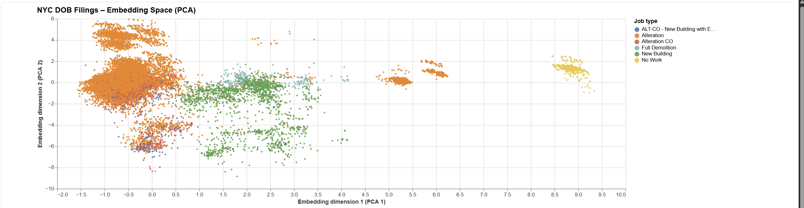
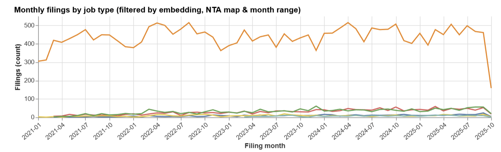
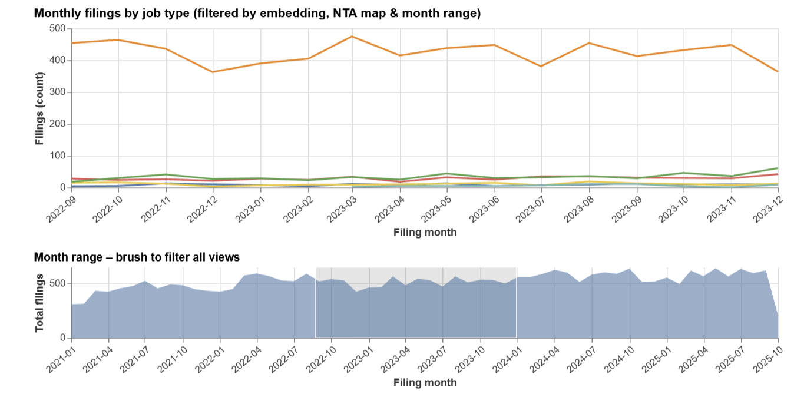
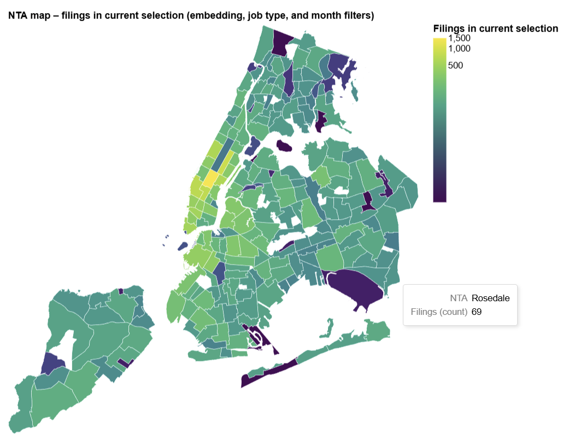
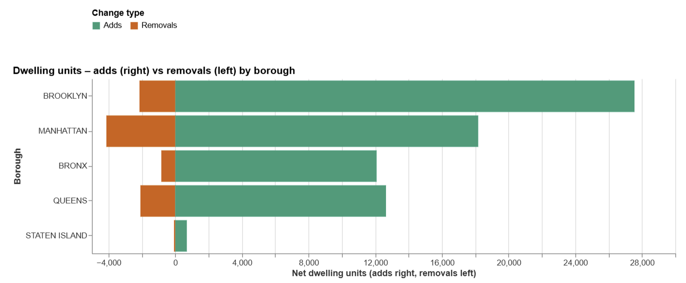
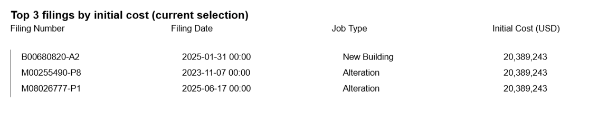
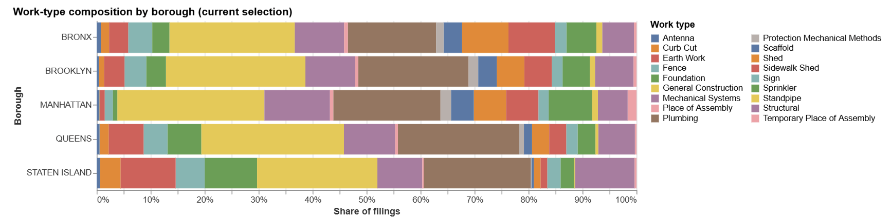
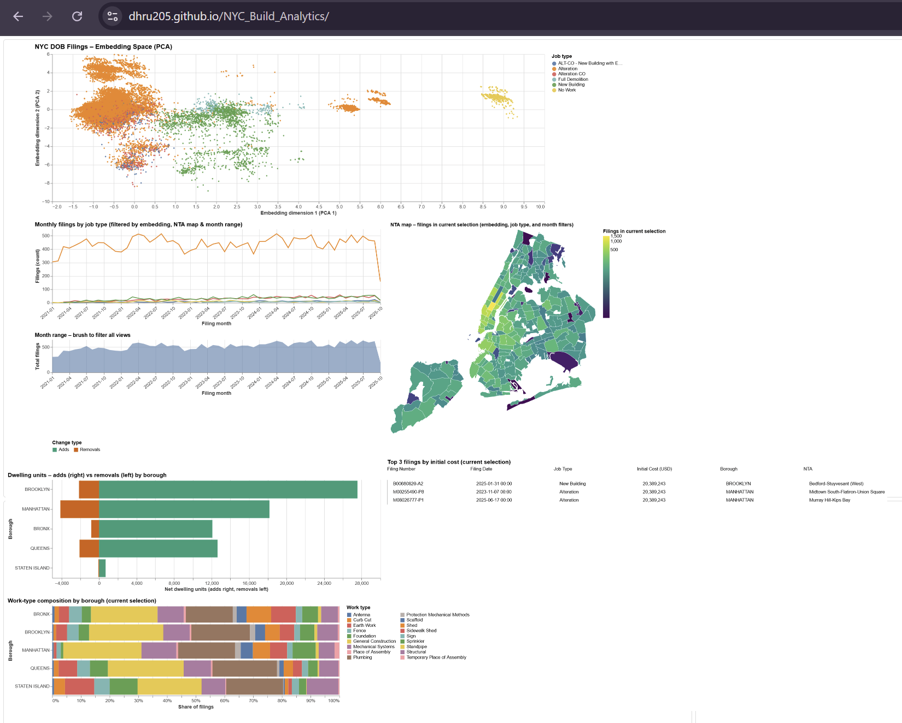

# Project Title : BuildNYC Analytics 

# CS424 - Assignment 4

## Group Members
* Siddhi Dabholkar - sdabh@uic.edu
* Dhru Prajapati  - dpraj7@uic.edu

### *Web Page : [NYC_Build_Analytics_Site](https://dhru205.github.io/NYC_Build_Analytics/)*
---
## Dataset

For this assignment, we reused the **NYC Department of Buildings (DOB) job filings** dataset that we worked with in Assignments 1-3. Each row corresponds to a single building job filing in New York City, describing what kind of work is being proposed, where it is located, and some characteristics of the building and project.
- **URL:** [DOB NOW: Build - Job Application Filings](https://data.cityofnewyork.us/Housing-Development/DOB-NOW-Build-Job-Application-Filings/w9ak-ipjd/about_data)
#### Coverage & Scope
- **Geography:** All five NYC boroughs.  
- **Time:** From 2021 TO 2025.
  **Size:** 679,968 rows x 81 columns
#### Identifiers & Administrative
- **`job_filing_number`**: Primary identifier for each filing.
#### Numerical Features:
- **`Initial Cost`**, **`FloorArea_imputed`**, **`Existing Dwelling Units`**,  **`Proposed Dwelling Units`**, **`Existing Stories`**, **`Proposed No of Stories`**, etc; 
#### Temporal Features:
- **`Filing Date`**, **`Approved Date`**,**`First Permit Date`**, **`Current Status Date`**, **`Signoff Date`**, **`approval days`**
- Note - Status history may be limited to the latest status; where stage-by-stage timestamps are missing, we rely on milestone dates (filing/approval/permit) for timing.   
#### Categorical Features:
- **`Job Type`**:   High-level permit category describing what kind of filing this is.
  - **NB : New Building**: construction of an entirely new building.  
  - **A1 : Alteration Type 1**: major alteration that changes use, egress, or occupancy and requires a new/amended Certificate of Occupancy.  
  - **A2 : Alteration Type 2**: alteration with *no* change to use/egress/occupancy, typically interior renovations involving multiple trades.  
  - **A3 : Alteration Type 3**: minor alteration involving a single type of work (e.g., curb cut, small façade work).  
  - **DM : Demolition**: full demolition/removal of an existing building or structure.
  - **NW : No Work**: administrative filings with no work.
- **`Work Type`**:  Binary feature that describes the specific technical scope of work on the filing; in DOB NOW this is encoded with short codes, and in our data we see work types such as:  General Construction, Plumbing, Sprinkler, Standpipe, Electrical, Curb Cut, Fire Protection/Alarm, Boiler, Fence, Foundation, Sidewalk Shade, Solar Panel, Earth Work, etc;  
- **`Filing Status`**: Text label describing where the job filing currently sits in the DOB NOW process; typical values in our dataset include:  Pre-filing, Applicant of Record Review, Pending Plan Examiner Assignment, Plan Examiner Review, Objections, Approved, Permit Issued / Permit Entire, Pending Sign Off Review / Sign Off Review in Progress, Signed off, Withdrawn, On-Hold.  
#### Spatial Features:
- **`Borough`**:  All five boroughs in NYC - Manhattan, Brooklyn, Queens, Staten Island, Bronx.
-  **`NTA` (Neighborhood Tabulation Area)**:  
  Fine-grained neighborhood identifier defined by NYC Planning; each value is a code-name pair like `MN17 Upper East Side` or `BK09 Crown Heights`, and in the dataset it appears as coded strings (e.g., `MN17`, `BK09`, …) that map to small neighborhood-sized areas within boroughs.
- **`Geo coordinates`**: Latitude, Longitude.

---

## Embeddings Constructions and  Projections(Task 1)

### 1. Preprocessing Pipeline and Parameter Choices

1. **Data filtering and cleaning**
   - Kept filings from 2021–2025 with valid `job_filing_number`, `Filing Date`, borough, NTA, and usable latitude/longitude.
   - Dropped obviously invalid records (e.g., missing core identifiers, impossible coordinates).

2. **Feature selection**
   - Selected a core set of attributes capturing:
     - **Project scale:** `Initial Cost`, `FloorArea_imputed`
     - **Housing impact:** `Existing Dwelling Units`, `Proposed Dwelling Units`, `delta_units`
     - **Time:** `Filing Date` and derived `year`, `month_sin`, `month_cos`
     - **Approval process:** `Approved Date`, `approval_days_cap`, `has_approval_date`
     - **Spatial context:** `Borough`, `NTA`, `Latitude`, `Longitude`, `NTA_coarse`, `med_boro`, `med_boro_job`
     - **Work-type fingerprint:** binary columns for each `Work Type` (General Construction, Plumbing, Sprinkler, Scaffold, etc.)

3. **Feature engineering**
   - Log transforms for highly skewed quantities:
     - `log_initial_cost = log1p(Initial Cost)`
     - `log_floor_area = log1p(FloorArea_imputed)`
   - Cyclical month encoding: `month_sin`, `month_cos` so December and January are neighbors.
   - Approval-time features: `approval_days` and capped `approval_days_cap` (0–730 days).
   - Missingness indicators: `has_existing_du`, `has_proposed_du`, `FloorArea_was_imputed`.
   - Grouped neighborhoods: `NTA_coarse` retains frequent NTAs and collapses the rest into `Other NTA`.

To turn this heterogeneous feature set into a clean numeric matrix, we use a **ColumnTransformer** with separate pipelines:

4. **Numeric pipeline**
  - `SimpleImputer(strategy="median")`  
    - Chosen for robustness to skew and outliers (e.g., cost, area, days).
  - `StandardScaler()`  
    - Standardizes each numeric feature to mean 0 and variance 1 so that no single feature with a large scale (e.g., cost) dominates the distances used by PCA.

5. **Categorical pipeline**
  - `OneHotEncoder(handle_unknown="ignore", sparse_output=False)`  
    - Produces one binary column per category.
    - `handle_unknown="ignore"` ensures that rare/unseen categories at test time do not break the pipeline.
    - `sparse_output=False` gives a dense NumPy array, which is convenient to pass directly into PCA.

We then called `preprocessor.fit_transform(df_emb)` to obtain the final high-dimensional numeric array `X_array` for all filings.

---
---

### 2.1 Dimensionality Reduction - Embedding Design Iterations 

#### Iteration 1 – Final PCA embedding (kept)

In our main notebook we first built an embedding focused on:

- **Scale:** `log_initial_cost`, `log_floor_area`
- **Housing:** `Existing Dwelling Units`, `Proposed Dwelling Units`, `delta_units`
- **Time:** `year`, `month_sin`, `month_cos`
- **Approval process:** `approval_days_cap`, `has_approval_date`
- **Spatial context:** `Borough`, `NTA_coarse`, `Latitude`, `Longitude`, `med_boro`, `med_boro_job`
- **Work types:** all binary `Work Type` flags
- **Categoricals:** one-hot encoded `Job Type`, `Borough`, `Building Type`, `NTA_coarse`

- We wanted the embedding to reflect **how big** a project is, **what kind of work** it involves, **where and when** it happens, and **how it affects housing**, without letting building height completely dominate.

**Effect:**  
The PCA plot showed:

- Clear separation of **New Building**, **Alteration**, **No Work**, and **Demolition** clusters.
- Smooth gradients along PC1/PC2 that correspond to **project scale** and **work-type mix**.
- Meaningful patterns by borough and NTA once linked with the map and temporal views.
On the preprocessed feature matrix `X_array`, we apply **Principal Component Analysis**:

- **Method:** `PCA` from scikit-learn  
- **Parameters:**
  - `n_components = 2` - we keep only the first two principal components so that each filing can be plotted in a 2D scatterplot.
  - `random_state = 0` - set for reproducibility.

PCA finds the directions of maximum variance in this high-dimensional feature space and projects each filing onto the first two components:

- `x_pca` - first principal component (PC1)
- `y_pca` - second principal component (PC2)

These two coordinates define the **embedding scatterplot** used throughout the dashboard.

---

#### Iteration 2 – Alternative embeddings we tried (rejected)

##### 2a. Adding vertical-form features (stories / heights)

We first modified the feature set by adding the following  into the numeric base before running PCA.:

- `Existing Stories`, `Proposed No of Stories`
- `Existing Height`, `Proposed Height`

- We did this to see whether explicitly encoding building height would reveal new structure (e.g., separating high-rise NB jobs from low-rise residential alterations).
**Observation:**  
- The first PCA component became heavily driven by **height/stories**, so the embedding mainly separated tall vs short buildings.
- Clusters were less aligned with our main narrative about **housing change, cost, and work-type mix**.
- Some job types that were previously cleanly separated became more entangled.
**Decision:**   We reverted to the original feature set and kept stories/heights only for **tooltips and supporting charts**, not as core embedding dimensions.

---
##### 2b. Switching to UMAP instead of PCA

We also experimented with using **UMAP** on the same preprocessed feature matrix `X_array` (on a sampled subset of filings for runtime):

- Used a standard configuration (e.g., moderate `n_neighbors` and small `min_dist`) to emphasize local neighborhoods.
- Generated 2D coordinates (`umap_x`, `umap_y`) and plugged them into the same Vega-Lite views.
- UMAP can capture **non-linear structure** and often produces visually tight clusters, so we wanted to check whether it would reveal additional patterns beyond PCA (e.g., more clearly separated work-type or neighborhood “islands”).
**Observation**
- UMAP did produce **tight local clusters**, but the **global layout was harder to interpret**:
  - Clusters floated as disconnected “islands” with no obvious global axes related to cost, area, or housing impact.
  - Similar runs with slightly different parameters or random seeds gave noticeably different layouts, which makes it difficult to explain and reproduce in a teaching setting.
- When linked with the NTA map and time-series views, it was harder to describe *why* two clusters were far apart (the separation no longer corresponded to simple combinations of features like cost/area/DU).
**Decision:**  
- For this dataset size and our narrative goals, **PCA** gave a **simpler, more stable, and more interpretable** 2D space:
  - Axes correlate with intuitive quantities (scale, work-type mix, housing impact).
  - The layout is deterministic and easy to reproduce for grading and future viewers.
- Because UMAP did not reveal qualitatively new patterns but added complexity and instability, we kept it as an experiment and **chose PCA as the final projection method** used in the dashboard.
---

### 2.2 Building and Saving the Embedding Tables

Finally, we assembled a dataframe `embeddings_df` that combines:

- **Embedding coordinates**
  - `x_pca`, `y_pca`

- **Record key**
  - `filing_id` (from `Job Filing Number`)

- **Selected original attributes for visualization**
  - `Job Type`, `Borough`, `NTA`, `NTA_coarse`
  - `Filing Date`, `mmYYYY`
  - `delta_units`, `Initial Cost`, `FloorArea_imputed`
  - `approval_days_cap`, `Latitude`, `Longitude`
  - Work-type flags and context features (`med_boro`, `med_boro_job`, `has_approval_date`, etc.)

We then exported:

- A full file:  
  - `embeddings_2d_full_pca.csv` - all rows with PCA coordinates and attributes.
- Downsampled versions for responsive web visualization:  
  - `embeddings_2d_sampled_20k.csv`, `embeddings_2d_sampled_30k.csv`, etc., created by random sampling when the full dataset is very large.

These CSV files are loaded directly by Vega-Lite in the standalone HTML interface and form the basis of all embedding-based views.

### 3. Interactive Dashboard (Task 2 & 3)
- We built a standalone web interface (`index.html`) that uses Vega-Lite to render a multi-view coordinated dashboard. The visualization is defined in `main.js` and organized into four vertical sections (`vconcat`).
- We hosted this web page on Github pages :  [NYC_Build_Analytics_Site](https://dhru205.github.io/NYC_Build_Analytics/)

### 3.1 Visual Encodings

#### 1. PCA embedding scatterplot (top left)

- **Marks & axes:** Each point is a single filing, plotted at `(x, y) = (PC1, PC2)` from the PCA projection.
- **Color:** Encodes **Job Type** (e.g., Alteration, New Building, No Work, Full Demolition, Alteration CO, ALT-CO), so that clusters in the embedding can be directly compared to the permit categories.
- **Opacity:** Points inside the active brush are drawn with higher opacity, while the rest are faded, emphasizing the current focus cluster.
- **Tooltips:** Show detailed attributes for the hovered filing (Job Filing Number, Borough, Job Type, Building Type, Filing Status, Initial Cost, FloorArea_imputed, Filing year, NTA), which lets the user inspect representative examples of each cluster.

We use this scatter as the *anchor view* of the interface: everything else responds to what is selected here.

---

#### 2. Monthly filings by job type (bottom left, middle)

- **Marks:** Multi-series line chart.
- **X:** Filing month (year-month).
- **Y:** Count of filings in that month.
- **Color:** Job Type, consistent with the embedding legend.
- **Encoding goal:** Show how the *volume of filings over time* differs by job type (e.g., Alterations dominating every month, while New Buildings and Demolitions are much rarer).
- This view is filtered by the current embedding / NTA / month selections, so it always reflects the subset the user is exploring.

---

#### 3. Month-range overview brush (bottom left)

- **Marks:** Area chart of total filings per month.
- **X:** Filing month.
- **Y:** Total count of filings in that month.
- **Interaction:** An interval brush on the x-axis defines a **month range**; this selection is used as a global temporal filter for *all* other views (embedding, time series, map, dwelling-unit and work-type charts).
- **Purpose:** Provide an overview of time while giving the user a simple way to “zoom in” on specific periods (e.g., a particular year or construction cycle).
---
#### 4. NTA choropleth map (top right)

- **Marks:** Polygon map of NYC Neighborhood Tabulation Areas (NTAs).
- **Color:** Shows the **number of filings in the current selection** (after embedding brush, Job Type and month filters), using a sequential color scale (purple → green → yellow) where yellow indicates NTAs with the highest activity.
- **Tooltip:** Displays NTA code/name and the current filings count.
- **Purpose:** Reveal **where in the city** the selected cluster or time range is concentrated, and highlight “hot” neighborhoods.
---
#### 5. Dwelling units - adds vs removals by borough (middle left)

- **Marks:** Diverging horizontal bar chart.
- **Y:** Borough.
- **X:** Net dwelling units, split into:
  - Green bars to the **right** for **adds**.
  - Orange bars to the **left** for **removals**.
- **Color:** Encodes **change type** (Adds vs Removals).
- **Encoding goal:** Summarize how the current selection contributes to housing: which boroughs are gaining units, and where there are notable removals.
---
#### 6. Top 3 filings by initial cost (middle right)

- **Marks:** Simple table.
- **Columns:** Filing Number, Filing Date, Job Type, Initial Cost (USD).
- **Ordering:** Sorted by Initial Cost (descending), so the largest projects in the current selection are always shown at the top.
- **Purpose:** Provide a **concrete “zoom-in”** on the most expensive projects underlying the patterns in the embedding and cost/area distributions.
---
#### 7. Work-type composition by borough (bottom)

- **Marks:** 100% stacked bar chart.
- **Y:** Borough.
- **X:** Share of filings (0-100%) in the current selection.
- **Color:** Work Type (e.g., General Construction, Plumbing, Sprinkler, Mechanical Systems, Foundation, Earth Work, Place of Assembly, Temporary Place of Assembly, Sidewalk Shed, Scaffold, Sign, Structural, etc.).
- **Encoding goal:** Show how the **mix of technical work types** differs across boroughs for the selected cluster/time range (for example, some boroughs being more GC-heavy vs plumbing-heavy).
---

### Visualization Interface

### 3.2 Interactions and Coordinated Views

The interface is driven by a small set of linked selections:

- **Embedding brush**
  - Brushing a region in the PCA embedding defines the **current cluster of interest**.
  - This selection filters:
    - The monthly filings-by-job-type line chart.
    - The NTA choropleth (counts recomputed only for brushed points).
    - The dwelling-unit adds vs removals chart.
    - The work-type composition chart.
    - The top-3 highest-cost filings table.
  - Points inside the brush are highlighted in the embedding; others are dimmed.

- **Job Type selection (legend toggle)**
  - Clicking job types in the legend acts as a **category filter**.
  - All views (embedding, time series, NTA map, DU chart, composition chart and top-3 table) update to include only the selected job types.
  - This lets users compare, for example, New Buildings vs Alterations within the same embedding region.

- **Month-range brush**
  - An interval selection on the month overview chart defines a **global time window**.
  - The embedding, time-series, map, DU chart, composition chart, and top-3 table all recompute using only filings within this month range.
  - This is useful to answer questions like “Did these clusters appear recently or have they been stable over several years?”

- **NTA map selection (if used)**
  - Clicking on an NTA on the map further restricts the selection to filings in that neighborhood.
  - The embedding and all other charts then show only filings in the brushed cluster **and** chosen NTA(s), allowing exploration of specific neighborhoods.

#### Together, these interactions let a user start from any dimension (cluster in embedding, time slice, job type, or neighborhood) and see how that subset behaves across all the others.
---

### 4. Initial Findings and Patterns

From these coordinated views we observe several patterns:

- **Distinct clusters by job type in embedding space.**  
  New Building filings and No Work filings occupy clearly separated regions along the first PCA axis, while Alteration jobs form dense bands that partially overlap but remain visually cohesive, indicating that job type, project scale, and work-type mix are strongly aligned.

- **Alterations dominate monthly volume.**  
  In the monthly filings chart, the Alteration line (orange) sits far above all others for almost every month, showing that A1/A2/A3 jobs make up the bulk of DOB activity, while New Buildings and Demolitions are comparatively rare but steady over time.

- **Spatial concentration of activity.**  
  The NTA map reveals that the highest filing counts in the current selection are concentrated in a handful of Manhattan and inner-borough NTAs (shown in yellow), while many outer neighborhoods remain teal or purple, suggesting strong geographic clustering of development.

- **Net housing gains across boroughs, with some removals.**  
  The dwelling-unit adds vs removals chart shows positive net DU change for most boroughs, especially Bronx and Queens, but also visible removals (orange bars) in places like Manhattan and Brooklyn, indicating that some projects reduce units even as others add housing.

- **Different work-type mixes by borough.**  
  The stacked work-type composition bars show that Manhattan and Queens have a larger share of General Construction and structural work, while certain boroughs have higher shares of system-focused filings (Plumbing, Mechanical Systems, Sprinkler), reflecting different local maintenance and development patterns.

- **Large, high-cost outliers.**  
  The “Top 3 filings by initial cost” table often surfaces very large New Building or Alteration jobs in high-activity NTAs, grounding the embedding clusters in concrete examples and helping us understand which individual mega-projects drive extremes in cost and floor area.

These findings demonstrate that the embedding space, combined with the linked temporal, spatial, and attribute views, provides a coherent way to explore how **job type, geography, time, housing impact, and work-type mix** interact in NYC DOB filings.

--- 

### 5. Collaboration Process

- We worked on this project together from start to finish, meeting regularly (in person and online) to plan milestones, divide work, and review each other’s changes through GitHub and screen-sharing.
- We sketched the overall dashboard layout: PCA embedding as the anchor view, with linked time-series views, an NTA map, housing-impact charts, and work-type composition.
- We jointly decided what “similarity” should mean in our embedding (project scale, housing impact, time, geography, and work-type mix).
*Siddhi’s main responsibilities:*
- Led the **data preparation and embedding construction**:
  - Cleaned and filtered the DOB subset (2021–2025) and selected the core attributes.
  - Implemented feature engineering in Python (log cost/area, delta_units, approval_days_cap, month encodings, missingness flags).
  - Ran PCA, experimented with alternative designs (adding stories/heights), and exported the final `embeddings_2d_` CSVs.
  - Worked on the script for PCA embedding scatterplot, Butterfly Chart for Dwelling Units and Choropleth.
*Dhru’s main responsibilities:*
  - Performed UMAP for dimensionality reduction.
  - Set up `index.html`, `style.css`, and `script.js`, and wired in Vega, Vega-Lite, and vega-embed.
  - Worked on Monthly filings by job type and the month-range brush, Work Type Composition Stacked Graph
  - Led the final deployment on **GitHub Pages** and verified that the public URL works.
*Joint work:*
- We debugged interactions together (selection propagation, tooltips, color-scale issues) and iteratively refined the visual design.
- We jointly prepared the final presentation, with each of us developing slides for our respective components and then reviewing and refining the deck together to ensure a clear, coherent narrative and smooth transitions between sections.

